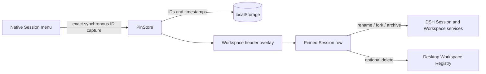

<p align="center">
  
</p>

# DSH Pinned Sessions

<p align="center">
  <a href="https://www.npmjs.com/package/@anionex/dsh-pinned-sessions"></a>
  <a href="https://github.com/Anionex/dsh-pinned-sessions/actions/workflows/ci.yml"></a>
  <a href="LICENSE"></a>
  
</p>

<p align="center"><strong>Pin important Sessions. Open them without searching through every Workspace.</strong></p>

<p align="center">
  <strong>English</strong> · <a href="README.zh.md">简体中文</a>
</p>

DeepSeek Harness keeps Sessions inside their original Workspaces. Once the list grows, returning to a few active Sessions takes repeated scanning. DSH Pinned Sessions adds a compact pinned section below the Workspace header while leaving every native Session row in place.

## See It in Action

<p align="center">
  
</p>

Hover a pinned row to reveal its ellipsis menu. The Web profile shows **Rename**, **Fork session**, **Unpin session**, and **Archive session**. The Desktop profile also shows **Delete session** when Archive Manager provides the same action on native rows.

## Highlights

- **Reach active work from the top of the sidebar:** pinned copies stay below the Workspace header, ordered newest first.
- **Keep native organization intact:** the original Session remains in its Workspace.
- **Use familiar actions:** pinned rows use DSH Menu, Modal, Button, icon, and service APIs.
- **Work with exact Session identities:** pinning never guesses from a title or list position.
- **Stay local:** the plugin stores Session IDs and pin timestamps in browser storage. It does not read or copy conversation content.
- **Navigate by keyboard:** Arrow keys move through the menu, Escape returns focus, and removed rows hand focus to the next useful target.

## Quick Start

Install the plugin in either profile, or run both commands:

```bash
dsh plugin add @anionex/dsh-pinned-sessions --profile web
dsh plugin add @anionex/dsh-pinned-sessions --profile desktop
```

Refresh Web or restart Desktop. Open any native Session ellipsis menu and choose **Pin session**. The pinned copy appears below the Workspace header; use **Unpin session** from either menu to remove it.

### Requirements

- DeepSeek Harness `>=0.1.0-rc.8 <0.2.0`
- Node.js `^22.19.0` or `>=24.0.0`
- A `web` or `desktop` DSH profile

## Compatibility

| Profile | Pinned-row actions | Verified behavior |
| --- | --- | --- |
| Web | Rename, Fork, Unpin, Archive | Official DSH primitives and Session/Workspace services |
| Desktop | Rename, Fork, Unpin, Archive, optional Delete | Delete and failure Toasts appear only while Archive Manager exposes its Session deletion capability |

The package declares the same pre-`0.2.0` DSH client range that it tests. It uses stable slot and ARIA anchors instead of generated CSS module names.

## How It Works



The plugin mounts through `shell.overlay`, observes `[data-slot="sidebar.workspaces"]`, and portals one compact list into the sidebar. Pin state uses the versioned key `dsh.pinned-sessions.v1`, keeps at most 500 unique IDs, and prunes Sessions that no longer exist or have been archived.

## Data and Limitations

- Pins belong to the current DSH browser origin/profile. The plugin does not sync them between machines.
- The plugin stores only Session IDs and `pinnedAt` timestamps in `localStorage`.
- Pinned rows duplicate native rows by design; they do not move or remove the originals.
- Delete stays hidden unless the Desktop deletion provider is active.
- DSH client APIs are still pre-`0.2.0`; install a compatible plugin release when DSH changes that contract.

## Development

```bash
git clone https://github.com/Anionex/dsh-pinned-sessions.git
cd dsh-pinned-sessions
corepack enable
pnpm install --frozen-lockfile
pnpm run check
```

`pnpm run check` type-checks both targets, rebuilds the distributable client, runs the Vitest and package-layout suites, and performs an npm pack dry run.

## Community

- Read [CONTRIBUTING.md](CONTRIBUTING.md) before opening a pull request.
- Report vulnerabilities through the process in [SECURITY.md](SECURITY.md).
- Use [SUPPORT.md](SUPPORT.md) to choose the right issue path.
- Review release history in [CHANGELOG.md](CHANGELOG.md).
- Read [FUNDING.md](FUNDING.md) before sponsoring maintenance.
- Follow the [Code of Conduct](CODE_OF_CONDUCT.md) in project spaces.

Released under the [MIT License](LICENSE).
