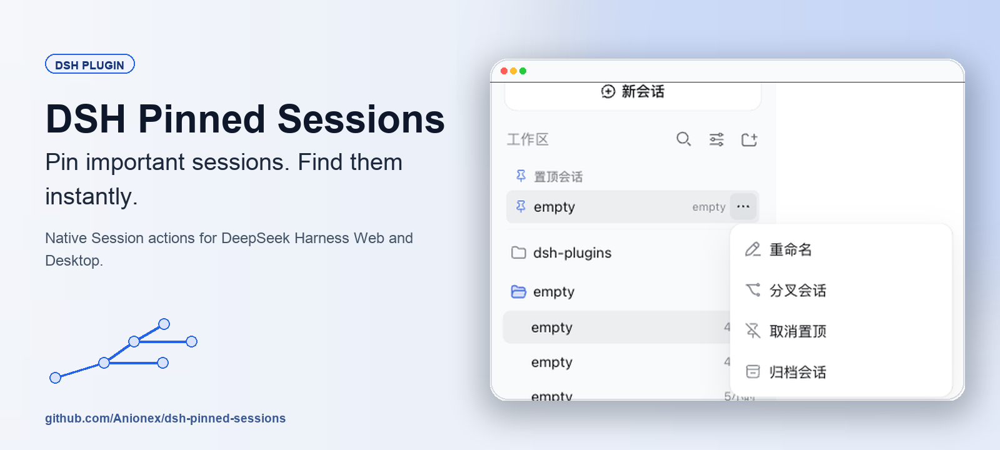
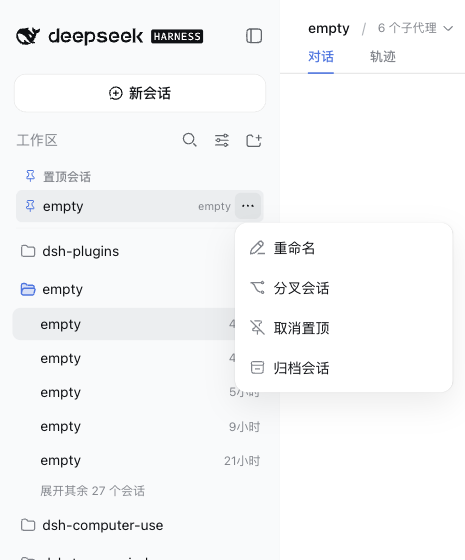
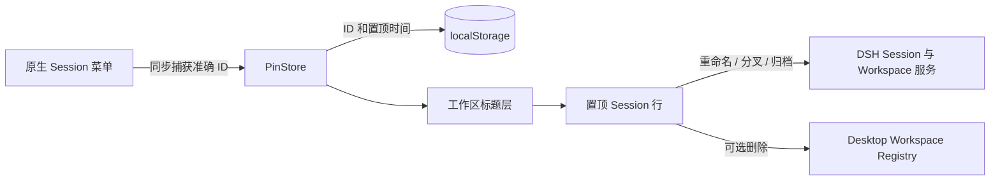

<p align="center">
  
</p>

# DSH Pinned Sessions

<p align="center">
  <a href="https://www.npmjs.com/package/@anionex/dsh-pinned-sessions"></a>
  <a href="https://github.com/Anionex/dsh-pinned-sessions/actions/workflows/ci.yml"></a>
  <a href="LICENSE"></a>
  
</p>

<p align="center"><strong>置顶重要会话，不必再从每个工作区里反复查找。</strong></p>

<p align="center">
  <a href="README.md">English</a> · <strong>简体中文</strong>
</p>

DeepSeek Harness 会把 Session 保留在原工作区中。会话增多后，返回少数活跃 Session 需要反复扫描列表。DSH Pinned Sessions 在工作区标题下增加一块紧凑的置顶区，同时保留每条原生 Session 行。

## 实际效果

<p align="center">
  
</p>

悬浮置顶行即可显示三点菜单。Web profile 提供**重命名**、**分叉会话**、**取消置顶**和**归档会话**。Desktop profile 在 Archive Manager 为原生会话提供删除能力时，还会显示**删除会话**。

## 主要能力

- **从侧栏顶部直接返回活跃任务：**置顶副本位于工作区标题下，按最近置顶排序。
- **保留原有工作区结构：**原生 Session 不会被移动或删除。
- **沿用熟悉的操作：**置顶行使用 DSH 的 Menu、Modal、Button、图标和服务 API。
- **绑定准确的 Session ID：**插件不会根据标题或列表位置猜测会话。
- **数据留在本机：**插件只保存 Session ID 和置顶时间，不读取或复制对话内容。
- **支持键盘操作：**方向键可切换菜单项，Escape 会归还焦点，删除行后焦点会落到下一个有效目标。

## 快速开始

按需安装到一个 profile，也可以执行两条命令：

```bash
dsh plugin add @anionex/dsh-pinned-sessions --profile web
dsh plugin add @anionex/dsh-pinned-sessions --profile desktop
```

刷新 Web 或重启 Desktop。打开任意原生 Session 的三点菜单，选择**置顶会话**。置顶副本会出现在工作区标题下；从任意一侧菜单选择**取消置顶**即可移除。

### 环境要求

- DeepSeek Harness `>=0.1.0-rc.8 <0.2.0`
- Node.js `^22.19.0` 或 `>=24.0.0`
- `web` 或 `desktop` DSH profile

## 兼容性

| Profile | 置顶行操作 | 已验证行为 |
| --- | --- | --- |
| Web | 重命名、分叉、取消置顶、归档 | 使用 DSH 官方组件和 Session/Workspace 服务 |
| Desktop | 重命名、分叉、取消置顶、归档、可选删除 | 仅在 Archive Manager 暴露删除能力时显示删除和失败 Toast |

包声明并测试了同一段 `0.2.0` 之前的 DSH 客户端版本范围。DOM 接入依赖稳定的 slot 和 ARIA 标记，不依赖构建生成的 CSS Module 类名。

## 工作原理



插件通过 `shell.overlay` 挂载，观察 `[data-slot="sidebar.workspaces"]`，再把一块紧凑列表 portal 到侧栏。置顶状态使用版本化键 `dsh.pinned-sessions.v1`，最多保留 500 个唯一 ID，并自动清理已不存在或已归档的 Session。

## 数据与限制

- 置顶状态属于当前 DSH 浏览器源/profile，不会跨设备同步。
- 插件只在 `localStorage` 中保存 Session ID 和 `pinnedAt` 时间戳。
- 置顶行是原生行的快捷副本，不会移动或删除原位置。
- Desktop 删除能力未加载时，删除菜单项保持隐藏。
- DSH 客户端 API 仍处于 `0.2.0` 之前；DSH 更改接口后，需要安装与其匹配的插件版本。

## 开发

```bash
git clone https://github.com/Anionex/dsh-pinned-sessions.git
cd dsh-pinned-sessions
corepack enable
pnpm install --frozen-lockfile
pnpm run check
```

`pnpm run check` 会检查两个目标的类型、重建可分发客户端、运行 Vitest 和包布局测试，并执行 npm 打包预检。

## 社区

- 提交 Pull Request 前请阅读 [CONTRIBUTING.md](CONTRIBUTING.md)。
- 安全问题按 [SECURITY.md](SECURITY.md) 中的私密渠道报告。
- [SUPPORT.md](SUPPORT.md) 说明了不同问题应使用的入口。
- [CHANGELOG.md](CHANGELOG.md) 记录每个版本的变化。
- 赞助维护工作前请阅读 [FUNDING.md](FUNDING.md)。
- 参与项目空间时请遵守 [行为准则](CODE_OF_CONDUCT.md)。

项目采用 [MIT License](LICENSE)。
